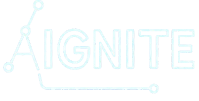

# 🌌 Aignite Club — AI & Tech Club Website

<p align="center">
  
</p>

<p align="center">
  <strong>The Official AI & Tech Club of Bharati Vidyapeeth Deemed University (BVDU).</strong><br />
  A premium, highly interactive digital hub designed for BVDU student builders, learners, and creators to collaborate, organize events, and push the boundaries of Artificial Intelligence.
</p>

<p align="center">
  
  
  
  
  
  
</p>

---

## 📖 Table of Contents

- [✨ Key Features](#-key-features)
- [🛠️ Tech Stack & Architecture](#️-tech-stack--architecture)
- [🌀 Animation & Interactivity Breakdown](#-animation--interactivity-breakdown)
- [📁 Project Structure](#-project-structure)
- [🎨 Design System & CSS Guide](#-design-system--css-guide)
- [🗺️ Pages & Features Overview](#️-pages--features-overview)
- [🚀 Getting Started](#-getting-started)
- [🤝 Contributing](#-contributing)
- [📄 License](#-license)

---

## ✨ Key Features

- **Arc Reactor & Neural Net Canvas**: A custom-built, interactive 2D HTML5 canvas in the Home hero depicting a highly complex Arc Reactor core surrounded by rotating orbits, comet particles, sweeping radar, tick dials, and double-pass glowing neural node connections.
- **Fluid Page Transitions**: Zero-teleport navigation where the departing page recedes and slides upward while the new page rises from below.
- **Custom Interactive Cursor**: A dual-element cursor system (center dot + trailing physics-lag ring) that morphs, expands, and blends with elements on hover.
- **Comprehensive Department Tabs**: Sleek department routing (Tech, Events, PR, Design, Content) on the Team page with interactive custom `TeamCard` slide-up detail drawers.
- **Featured Flagship Countdown & Registration**: Flip-digit airport departure style live countdown timer for upcoming major events with an integrated inline registration dashboard.
- **Tailwind CSS v4 Engine**: Built with the latest, high-performance Tailwind CSS v4 pipeline utilizing standard-compliant CSS variables and native `@theme` configurations.

---

## 🛠️ Tech Stack & Architecture

| Technology | Purpose | Implementation Details |
| :--- | :--- | :--- |
| **React 19** | UI Library | Built on React 19.2.x for modern component architecture and state hooks. |
| **Vite 8** | Dev Tooling & Bundler | High-speed compiler utilizing `@tailwindcss/vite` for single-step build pipelines. |
| **Tailwind CSS v4** | CSS Styling | Native Tailwind v4 with `@import "tailwindcss"` and theme customization inside `index.css`. |
| **Framer Motion** | Micro-interactions | Handles routing transitions, spring indicators, and height-expanding accordions. |
| **Anime.js** | Scroll & Timeline | Powers staggered letters entrance sequences and scroll-triggered fade animations. |
| **HTML5 Canvas API** | Render Engine | Powers the Arc Reactor system and ambient particle backgrounds with high FPS rendering loops. |

---

## 🌀 Animation & Interactivity Breakdown

To achieve a futuristic, premium developer aesthetic, animations are handled by specific libraries best suited for their respective jobs:

### 1. Framer Motion
Installed as a core dependency (`^11.18.0`), Framer Motion is utilized for layout-aware and entry/exit states:
- **Global Page Transitions** ([PageTransition.jsx](file:///c:/Users/Dell-Dxb/Desktop/Aignite/Frontend/src/components/PageTransition.jsx)): A wrapper surrounding the active route. It coordinates exit (`opacity: 0, y: -20`) and entry (`opacity: 1, y: 0`) states over a `350ms` cubic-bezier transition.
- **Desktop Nav Underline & Mobile Dot Indicator** ([Navbar.jsx](file:///c:/Users/Dell-Dxb/Desktop/Aignite/Frontend/src/components/Navbar.jsx)): A single `motion.div` configured with physical spring constants (`stiffness: 380`, `damping: 30`) that slides smoothly between navigation headings as page state shifts.
- **Inline Event Register Form** ([Events.jsx](file:///c:/Users/Dell-Dxb/Desktop/Aignite/Frontend/src/pages/Events.jsx)): An accordion-like height expander (`initial={{ height: 0 }}`, `animate={{ height: "auto" }}`) revealing the RSVP input forms.

### 2. Anime.js
Loaded globally via CDN inside [index.html](file:///c:/Users/Dell-Dxb/Desktop/Aignite/Frontend/index.html) to keep bundle sizes lean, `anime.js` is leveraged for stagger offsets and scroll triggers:
- **Custom Scroll Hook** ([useScrollAnimate.js](file:///c:/Users/Dell-Dxb/Desktop/Aignite/Frontend/src/hooks/useScrollAnimate.js)): Connects React components with `IntersectionObserver`. Whenever an element with `data-animate` enters viewport thresholds, it fires custom `anime.js` transforms (`fade-up`, `fade-left`, `zoom-in`, or child-stagger arrays).
- **Opening Neural Loader** ([NeuralLoader.jsx](file:///c:/Users/Dell-Dxb/Desktop/Aignite/Frontend/src/components/NeuralLoader.jsx)): Uses `anime.timeline` to stagger letters of the "AIGNITE" title card with elastic springs, fading them in sequence, followed by an overlay wipe.

### 3. Native Canvas API & RequestAnimationFrame
For continuous math-heavy physics simulation where DOM manipulation is too slow, native `requestAnimationFrame` and 2D Context are used:
- **Interactive Particle Field** ([Home.jsx:34-106](file:///c:/Users/Dell-Dxb/Desktop/Aignite/Frontend/src/pages/Home.jsx#L34-L106)): Ambient grid drawing 35 nodes connecting dynamically with nearby peers and moving away gently from the user's cursor.
- **Arc Reactor & Neural Brain** ([HeroRobot.jsx](file:///c:/Users/Dell-Dxb/Desktop/Aignite/Frontend/src/components/HeroRobot.jsx)): A cinematic visual drawing:
  - 5 orbital ring tracks with flowing comet trails.
  - A sweeping transparent radar wedge.
  - An outer dial drawing 60 ticks.
  - 12 radial spokes and double-pass glowing synaptic connections.
  - Staggered HUD sparkline waveforms and charts detailing real-time statistics.

### 4. GSAP (GreenSock Animation Platform)
- **Dependency** (`^3.15.0`): Included in the repository's dependencies (`package.json`) to serve as the default platform for custom complex timelines, SVG path morphs, and upcoming multi-timeline sequencing.

---

## 📁 Project Structure

```
Aignite/
├── Frontend/
│   ├── src/
│   │   ├── assets/              # Static logo assets & branding images
│   │   ├── components/          # Reusable UI elements & canvas renders
│   │   │   ├── HeroRobot.jsx    # Canvas Arc Reactor + Neural Net
│   │   │   ├── Navbar.jsx       # Floating desktop nav & mobile bottom bar
│   │   │   ├── NeuralLoader.jsx # Entry timeline load animation
│   │   │   ├── NeuralNet.jsx    # Visual canvas for scrolling network charts
│   │   │   ├── PageTransition.jsx # Route entry/exit animations
│   │   │   ├── ScrollProgressBar.jsx # Top layout scroll percentage indicator
│   │   │   ├── TeamCard.jsx     # Complex department user details drawer
│   │   │   └── Footer.jsx       # Global footer layout
│   │   ├── hooks/               # Custom React lifecycle hooks
│   │   │   ├── useCountUp.js    # Viewport-triggered statistics counts
│   │   │   ├── useCursorEffect.js # Global dual-circle custom cursor physics
│   │   │   ├── useScrollAnimate.js # anime.js-driven scroll intersection wrapper
│   │   │   └── useScrollProgress.js # Calculates scroll percentage
│   │   ├── pages/               # Page routing components
│   │   │   ├── Home.jsx         # Hero, statistics, core pillars, call-to-actions
│   │   │   ├── About.jsx        # Cinematic vision, bento grid, event cluster, join benefits
│   │   │   ├── Events.jsx       # Featured flagship, filterable schedule, RSVP panel, past timeline
│   │   │   └── Team.jsx         # Dept filters & core member displays
│   │   ├── Icons.jsx            # Custom, highly-optimized inline SVG vector icons
│   │   ├── index.css            # Tailwind CSS v4 globals & custom design systems
│   │   └── main.jsx             # React DOM root render
│   ├── public/                  # Raw static assets
│   ├── package.json             # Dev dependencies & scripts
│   ├── vite.config.js           # Vite server configuration with Tailwind v4
│   └── index.html               # App template script links
├── package.json                 # Parent environment configurations
└── README.md                    # Project documentation (this file)
```

---

## 🎨 Design System & CSS Guide

The aesthetic is based on a high-fidelity **Sci-Fi Cyberpunk/Deep Navy & Cyan** theme. All custom styles are managed as utility tokens in [index.css](file:///c:/Users/Dell-Dxb/Desktop/Aignite/Frontend/src/index.css):

### Color Tokens
- **Background**: `#050d1a` (Deep cosmic navy)
- **Primary Accent**: `#00d4ff` (Neon electric cyan)
- **Warning/Timeline/Dates**: `#e8a020` (Bright amber)
- **Text Light**: `#e8f4f8` (Off-white)
- **Text Muted**: `#4a6070` (Slate blue)

### Utility Classes
- `.depth-card`: Cards with gradients and shadows that elevate and glow on hover (`translateY(-6px)`).
- `.glass`: Blur-based container backdrop overlays.
- `.grad-text`: Smooth 3-color animated gradient text shift.
- `.svg-grid`: Static grid layout implying structural engineering guidelines.
- `.btn-glow`: Interactive button style that triggers radial neon glows and slides icons forward.
- `.scanline`: Ambient cathode-ray scan overlay across pages.

---

## 🗺️ Pages & Features Overview

### 🏡 Homepage
- A immersive greeting header featuring the **Arc Reactor & Neural Brain** canvas.
- Staggered technology pills (CNNs, Backpropagation, LLMs, Vector Databases) animating on enter.
- Animated counters showing active club members and project stats.

### ℹ️ About Page
- **Cinematic Hero**: A futuristic portal graphic accompanied by core target metrics.
- **Bento Grid**: Interactive cards displaying Core Ideals (Research, Engineering, and Community).
- **Structured Timeline**: Dynamic 2-column list layout showing our key values (Inaugurals, Workshops, and Hackathons).

### 📅 Events Page
- **Flagship Event Widget**: Features a custom circular conic-gradient border, active registration form, and airport departure countdown.
- **Filtered Schedule**: Categorize sessions, workshops, guest lectures, and events.
- **Past Impact**: Interactive timeline with background zoom effects highlighting student achievements.

### 👥 Team Page
- Department tabs (Tech, PR, Events, Design, Content) utilizing responsive wraps.
- Custom **TeamCard** details drawer: Hovering or clicking a team card initiates a slide-up drawer displaying social icons, roles, and a department-themed neon glow border.

---

## 🚀 Getting Started

### Prerequisites
Make sure you have [Node.js](https://nodejs.org/) installed (v18+ recommended) along with `npm`.

### Installation

1. Clone the repository:
   ```bash
   git clone https://github.com/CodewithHammad08/Aignite_Club.git
   cd Aignite_Club
   ```

2. Navigate to the Frontend directory and install dependencies:
   ```bash
   cd Frontend
   npm install
   ```

3. Start the development server:
   ```bash
   npm run dev
   ```
   The application will be served locally at `http://localhost:5173`.

4. Build the production build:
   ```bash
   npm run build
   ```

---

## 🤝 Contributing

We welcome additions, fixes, and design updates!
- Maintain documentation integrity and preserve inline CSS system variables.
- Do not modify core animations in `TeamCard.jsx` without thorough validation.
- Make changes on specific feature branches: `git checkout -b feature/your-feature-name`.

---

## 📄 License

This project is licensed under the MIT License. See the LICENSE file for details.
